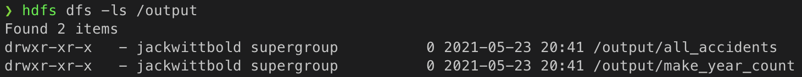
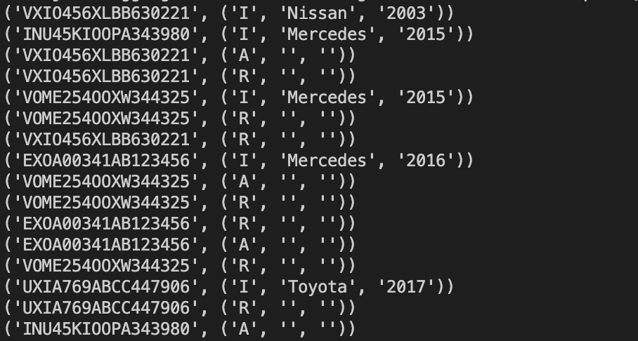
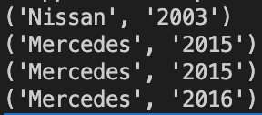
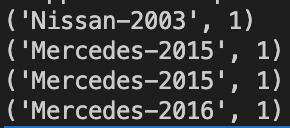
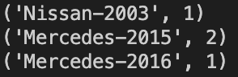
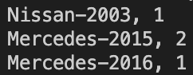
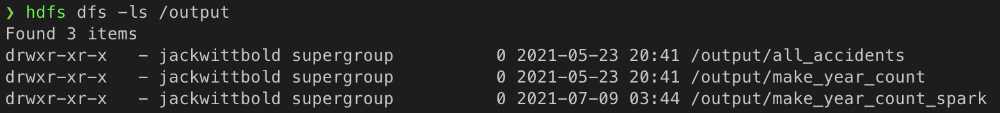
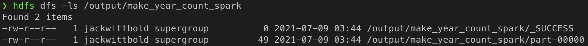
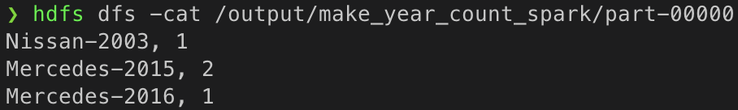

# autoinc-hdfs-spark

This project is a follow up to a previous project located here:\
https://github.com/jwittbold/hadoop_streaming_mapreduce \
This previous project utilized a series of MapReduce jobs to return records of vehicle accident reports.


In this project we will work with the same dataset and achieve the same output, but we will be executing it utilizing the Spark framework while working with a Spark RDD (Resilient Distributed Dataset). This project highlights the advantages of working with Spark and the simplicity it allows for when compared to traditional MapReduce jobs. 

The following assumes you have working installations of Hadoop and Spark. Please refer to the previoulsy mentioned project for info regarding setting up Hadoop. 

## File on HDFS
As seen below, our data file is already present within HDFS as it was added in the previous project.\
```hdfs dfs -ls /input```


## HDFS output directory before running script
HDFS output directory contains output from the previous project's MapReduce jobs. \
To view the contents: \
```hdfs dfs -ls /output```




## Contents of data.csv
We can take a look at the contents of our data file by running:\
```hdfs dfs -cat /input/data.csv ```


## Raw RDD
Within ```autoinc_spark.py``` we have built a SparkSession and using SparkContext we have created an RDD from \
```/input/data.csv``` 

We can view the contents by collecting the raw RDD and the output will appear as below:


## Mapping Values
In the next step, the ```extract_vin_kv()``` function is mapped to each element within the RDD in order to return records formated as: \
(VIN, (incident_type, make, year)) tuple.



## GroupByKey, FlatMap populate_make() function
Because only 'I' records contain full vehicle information, but we only want accident 'A' records, we must propagate 'make' and 'year' values from 'I' to 'A' records. This is achieved by using Spark's groupByKey() and flatMap() methods to apply our populate_make() function on records sharing the same key.
The result is shown below; four accident records consisting of vehicle make and year.



## Extract Make, map extract_make_kv() function
The next step creates a composite key from 'make' and 'year', and outputs records as a tuple containing 'make-year' and a count set to 1. \
The count element will be used in the following reduceByKey step. 

As shown below, vehicle records are formatted as (make-year, 1)



## ReduceByKey 
<<<<<<< HEAD
Using Spark's reduceByKey() method groups records by key and applies custom logic to aggregate the sum of values (the '1' in the previous step)
=======
Using Spark's reduceByKey() method groups records by key and applies custom logic to aggregate the sum of values (the '1' in the previous step) \
>>>>>>> a68b9eeff8d01f64922e7460ad88b8b51476db5a


## Final output as string
Our final output is cast as a string and saved to HDFS using .saveAsTextFile() \



## HDFS output directory after running script 
HDFS now contains a new directory,  ```/output/make_year_count_spark```  
To view the contents: \
```hdfs dfs -ls /output```



## Files created in HDFS '/output/make_year_count_spark'
To view the contents of the newly created directory:\
```hdfs dfs -ls /output/make_year_count_spark```



## Results from Spark job
Exploring the contents of the output from the Spark job we can see that the job executed successfully and we have three accident records showing vehicle make, year, and total accidents for each vehicle with an accident record. \
```hdfs dfs -cat /output/make_year_count_spark/part-00000```



## To Reproduce
To reproduce this project please first visit the repository linked to at the at beginning of this README and again here:\
https://github.com/jwittbold/hadoop_streaming_mapreduce \
Using the steps outlined there you will create the needed directories on HDFS in order to reproduce this project. 

## Run the Spark Job
Once the HDFS directories are set-up, you can run this Spark job using the provided Shell script:\
```run_autoinc_spark.sh```

Within your terminal navigate to the directory containing this file and enter:\
```sh run_autoinc_spark.sh```

The successful vehicle accident report will be output to HDFS seen here: \
```hdfs dfs -cat /output/make_year_count_spark/part-00000```

A file called ```job_log.txt``` will have been created in the same directory that ```run_autoinc_spark.sh``` was run from. \
It contains the complete Spark job stacktrace as captured from STDERR and STDOUT. 
